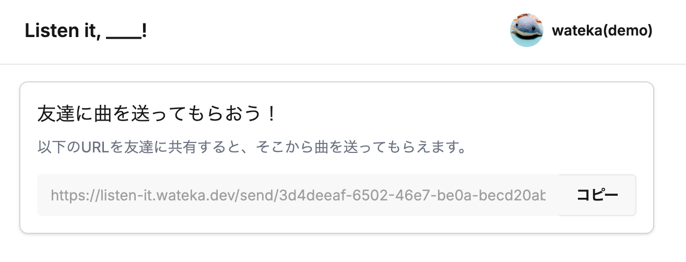
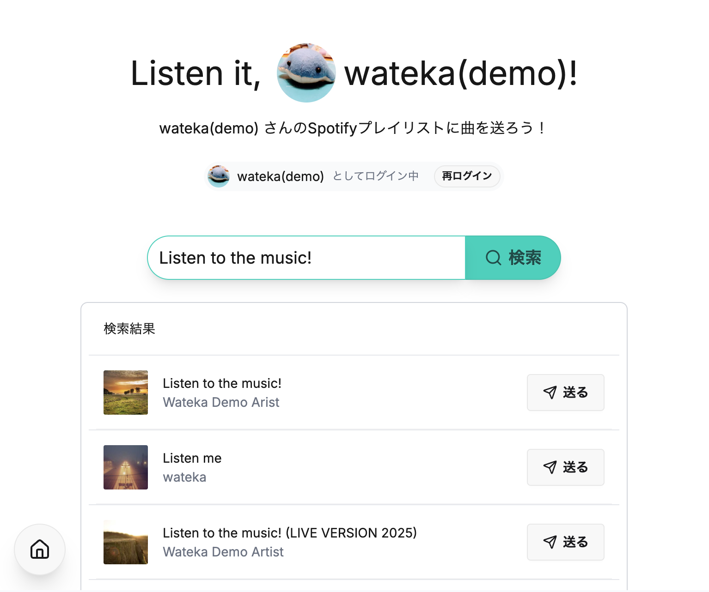
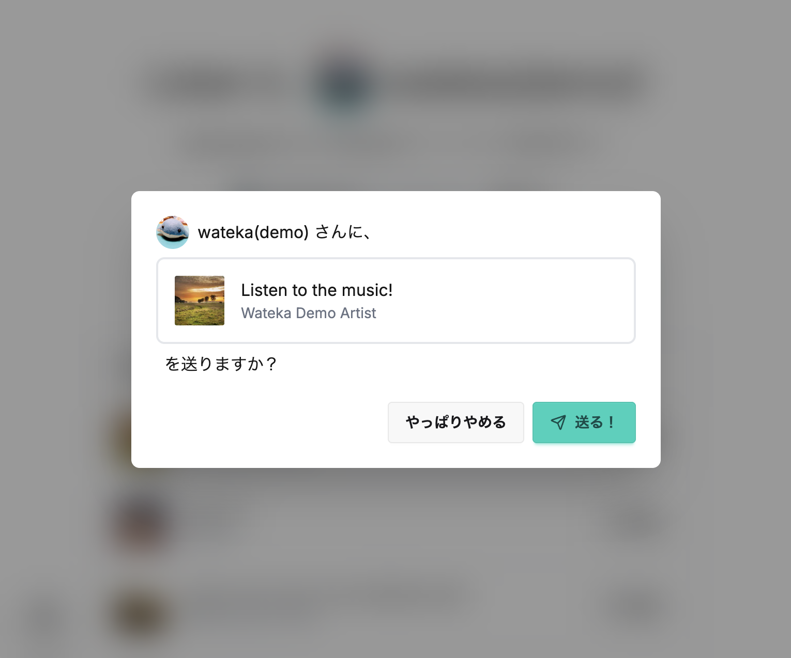

# Listen it, ____!

このアプリは、友達の聴いてほしい曲を、自分の Spotify プレイリストに直接送ってもらうためのアプリです。

Spotify ユーザではない友達も、このアプリ上で曲を検索してあなたに送るだけで、簡単にあなたの Spotify プレイリストに曲を追加できます。

「おすすめされた曲を、つい聴き忘れてしまう」という方におすすめのアプリです。

## 技術スタック

- TypeScript
- React & Next.js (フロントエンド)
- Auth.js (Google & Spotify 認証)
- Spotify API
- Tailwind CSS & Daisy UI
- Hono & Hono RPC (バックエンド)
- Drizzle ORM
- Turso (SQLite データベース)
- Vercel (ホスティング)

## 機能紹介

https://listen-it.wateka.dev から、利用することができます。

1. Spotify でログインして、送り先のURLを友達に共有する
   
2. 友達に、URL を開いてもらって、そこから曲を送ってもらう
   
   
3. あなたの Spotify プレイリストに、自動で曲が入ります！
